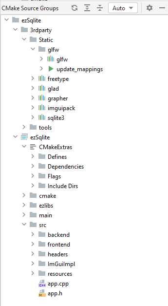

# CmakeSourceGroups

CmakeSourceGroups is a CLion plugin for display as a pane the source groups tree of a CMake project, 

similarly as what visual studio is doing from long time ago

# Minimal versions supported 

CLion : 2024.1
CMake : 3.17

# Infos

You will have a pane Called "CMake Source Groups"

In the title bar you can select the mode

In each target you will have a special directory called "CMakeExtra" where you can find many sections :
* Defines : List of defines of your target
* Dependencies : The targets dependencies
* Flags : Compile and link flags of your target
* Include Dirs : list of includes dirs of your target

A sample of what its rely with one of my projects :

